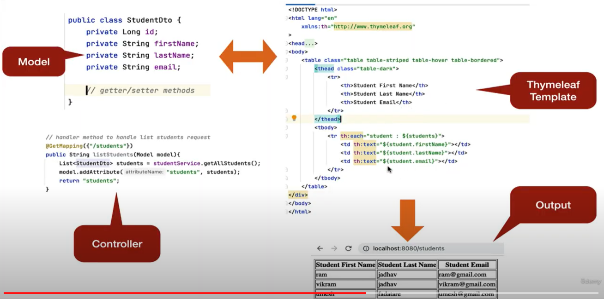

## What is Thymeleaf
1. Thymeleaf is a modern server-side java template engine for both web and standalone environments, capable of processing
HTML, XML, JavaScript, CSS and even plain text.
2. The main goal of Thymeleaf is to provide an elegant and highly-maintainable way of creating templates.
3. It's commonly used to generate HTML views for web applications.
4. Thymeleaf is the best choice for developing Spring MVC web application.

## What kind of Templates can Thymeleaf process?
Out-of-the-box, Thymeleaf allows you to process six kinds of templates:

1. HTML
2. XML
3. TEXT
4. JAVASCRIPT
5. CSS
6. RAW (plain text)

## What is a Thymeleaf Template?
Thymeleaf template can be a HTML, XML, JavaScript, CSS, etc.

**For Example**: Here the is Thymeleaf HTML template with HTML code and Thymeleaf expressions.
```
<table class="table table-striped table-hover table-bordered">
    <thead class="table-dark">
        <tr>
            <th>#</th>
            <th>Email</th>
            <th>Comment</th>
            <th>Created Date</th>
            <th>Actions</th>
        </tr>
    </thead>
    <tbody>
        <tr th:each="comment, iterStat : ${comments}">
            <td th:text="${iterStat.count}"></td>
            <td th:text="${comment.email}"></td>
            <td th:text="${comment.content}"></td>
            <td th:text="${#temporals.format(comment.createdon, 'dd MMM yyyy')}"></td>
            <td>
                <a class="btn btn-danger" th:href="@{/admin/posts/comments/{comme}(comme=${comment.id})}">Delete</a>
            </td>
        </tr>
    </tbody>
</table>
```
> **${comments}** Thymeleaf Expression

## Where's a Thymeleaf Template Processed?
In web application (Ex: Spring MVC web application), Thymeleaf is processed on the server side and the results are include
in the HTML and returned to the browser.

## How Thymeleaf Engine Works


## The spring-boot-starter-thymeleaf starter Dependency
- Spring Boot provide auto-configuration for thymeleaf by adding the spring-boot-starter-thymeleaf dependency
- spring-boot-starter-thymeleaf dependency integrate Thymeleaf with Spring integration dependencies
- Spring boot automatically configures view resolver for Thymeleaf
- Spring boot auto configure location for Thymeleaf template. By default, Spring boot will look for Thymeleaf templates
in /resources/templates folder.

## Development Steps
1. Create Handle Method to Handle the HTTP Request (GET or POST)
2. Handle Method Returns Model and View (Thymeleaf Template name)
3. Create Thymeleaf Template View and Display Model Data

## Thymeleaf Standard Expression
Five types of Thymeleaf standard expression:
1. **${...}**: Variable Expression
2. ***{...}**: Selection Expression
3. **#{...}**: Message(i18n) expressions
4. **@{...}**: Link(URL) expression
5. **~{...}**: Fragment expressions

### Variable Expression
Variable expression are the most commonly used ones in thymeleaf templates. These expressions help bind the data from
the template context(model) into the resulting html(view).

**Syntax:**
> ${VariableName}

## Variable Expressions Example
Consider we have added data to model in Spring MVC controller and in order to access the model data, we use thymeleaf
Variable expression:

```java
@Controller
public class HelloWorldController {

    @GetMapping("/hello-world")
    public String helloWorld(Model model) {
        model.addAttribute("message", "Hello World!");
        return "hello-world";
    }
}
```
**Noted:** 
- "message": Model variable Name
- "Hello World": Model variable Value

```html
<!DOCTYPE html>
<html lang="en" xmlns:th="http://www.thymeleaf.org">
<head>
    <meta charset="UTF-8">
    <title>Thymeleaf</title>
</head>
<body>
    <h2 th:text="${message}"></h2>
</body>
</html>
```
**Noted:** 
- ${message}: Variable expression

## Select Expression
1. Select expression are just like variable expressions, except they will be executed on a previously selected object
instead of hte whole context variables map.
2. To use selection expressions you first need to find a th:object attribute. After that, you can use th selection
expression to select the attributes / fields of the selected object.

```html
<h2> User Detail </h2>
<div th:object="${user}">
    <p>Name: <strong th:text="*{name}"></strong></p>
    <p>Email: <strong th:text="*{email}"></strong></p>
    <p>Role: <strong th:text="*{role}"></strong></p>
    <p>Gender: <strong th:text="*{gender}"></strong></p>
</div>
```
**Noted:**
> - **th:object** Selected object <br>
> - "*{name}" Select Expression

## Message Expression
1. Message expression let you externalize common texts into a properties file.
2. Syntax: **#{message.property.key}.**
3. Let's say you have a welcome message that you want to show on every view. However, hardcoding this message on all of
these views is a bad idea.

> app.nme=Blog Application <br>
> welcome.message=Hello, welcome to our blog application

```html
<body>
    <h1>Message Expression Demo:</h1>
    <h2 th:text="#{app.name}"></h2>
    <h2 th:text="#{welcome.message}"></h2>
</body>
```

## Link Expression
Link expression are meant to build URLs in a Thymeleaf templates.
**Syntax: @{link}**

```html
<!DOCTYPE html>
<html lang="en" xmlns:th="http://www.thymeleaf.org">
<head>
    <meta charset="UTF-8">
    <title>Link Expression</title>
    <link th:href="@{/css/demo.css}" rel="stylesheet" />
</head>
<body>
    <a th:href="@{/message}"> Hello World Link </a>
    <a th:href="@{/message/{id}(id=${id})}"> Link with Parameter </a>
</body>
</html>
```
**Noted:**
> @: Link Expression

## Fragment Expression
Fragment expression are an easy way to represent fragments of markup and move them around templates.

> Syntax: ~{fragment name}

There are three basic ways to include content from a fragment:
1. **th:insert** - inserts content inside the tag
2. **th:replace** - replaces the current tag with the tag defining the fragment
3. **th:include** - this is deprecated but it may still appear in a legacy code.

## The th:text attribute
This attribute is responsible for displaying text that is evaluated from the expression inside it;

Example: to Display a message:
```html
<p th:text="${message}"> Hello Good Morning!> </p>
```

The **th:text** attribute, which evaluates its value expression and sets the result as the body of the host tag,
effectively replacing the "Hello Good Morning!" tex we see in the code.

## The th:each attribute
In Thymeleaf, iteration or looping is achieved by using the **th:each** attribute.

One of the interesting things about this attribute is that it will accept and iterate over some different data types,
such as: List, Set, Map, Array

```html
    <tr th:each="user: ${users}">
        <td th:text="${user.name}"></td>
        <td th:text="${user.email}"></td>
        <td th:text="${user.role}"></td>
        <td th:text="${user.gender}"></td>
    </tr>
```

## The th:each attribute Status Variable
Thymeleaf also enable a useful mechanism to keep track of the iteration process via the status variable.

```html
<tr th:each="user, userStat : ${users}">
    <td th:text="${userStat.count}"></td>
    <td th:text="${user.name}"></td>
    <td th:text="${user.email}"></td>
    <td th:text="${user.role}"></td>
    <td th:text="${user.gender}"></td>
</tr>
```
Noted:
> - **userStat**: Status Variable
> - **count**: States Variable count property

## The th:each attribute Status Variable
The status variable provides the following properties:

- **index**: the current iteration index, starting with 0 (zero)
- **count**: the number of elements processed so far
- **size**: the total number of elements in the list
- **even/odd**: checks if the current iteration index is even or odd
- **first**: checks if the current iteration is the first one
- **last**: checks if the current iteration is the last one

## Thymeleaf th:if and th:unless conditions
The **th:if** and **th:unless** attributes allow use to render and HTML element depending on a provided condition.
**Syntax:**

```html
<div th:if="${condition}">
    <p>TRUE</p>
</div>
<div th:unless="${condition}">
    <p>FALSE</p>
</div>
```

### Thymeleaf th:if and unless conditions Example
```html
<tr th:each="user : ${users}">
    <td th:text="${user.name}"></td>
    <td th:text="${user.email}"></td>
    <td th:text="${user.role}"></td>
    <td>
        <a th:if="${user.role} == 'ADMIN'"> Update </a>
        <a th:if="${user.role} == 'ADMIN'"> Delete </a>
        <a th:unless="${user.role} == 'ADMIN'"> View </a>
    </td>
</tr>
```

## The switch-case condition
If there are more than two possible results of an expression, we can use **th:switch** and **th:case** attributes for
the conditional rendering of the HTML elements.

```html
<div class="rows">
    <h1> Thymeleaf switch case demo</h1>
    <h4 th:utext="${user.name}"></h4>
    <div th:switch="${user.role}">
        <p th:case="'ADMIN'"> User is an administrator </p>
        <!-- * for default case -->
        <p th:case="*"> User is some other thing </p>
    </div>
</div>
```
**Noted:**
> * for default case

## Form Handling in Thymeleaf - Attributes

- The **th:action** attribute is used to define action URL for form. This attribute replaces the HTML action attribute of
a `<form>`
- The **th:object** attribute is used to bind the fields of the form to an model object.
- The **th:field** attribute points to the field name of the model object.

## Thymeleaf Form Handling - Example

```html
<form action="#" th:action="@{/register/save}" method="post" th:object="${userForm}">
  <label>Full name:</label>
  <input type="text" th:field="*{name}" /><br /><br />

<label>E-mail:</label>
<input type="text" th:field="*{email}" /><br /><br />

<label>Password:</label>
<input type="password" th:field="*{password}" /><br /><br />

<label>Gender:</label>
<input type="radio" th:field="*{gender}" value="Male" />Male
<input type="radio" th:field="*{gender}" value="Female" />Female<br /><br />

<label>Profession:</label>
<select th:field="*{profession}">
<option th:each="p : ${listProfession}" th:value="${p}" th:text="${p}" />
</select><br /><br />

<label>Address:</label>
<textarea rows="5" cols="25" th:field="*{address}"></textarea><br /><br />

<button type="submit">Register</button>
</form>
```

### Model Class
```java
public class UserForm {
  private String name;
  private String email;
  private String password;
  private String gender;
  private String address;
  private boolean married;
  private String profession;
}
```
